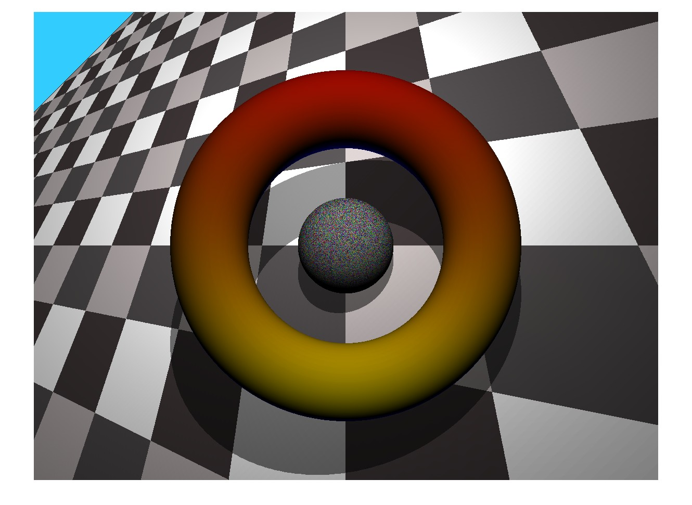
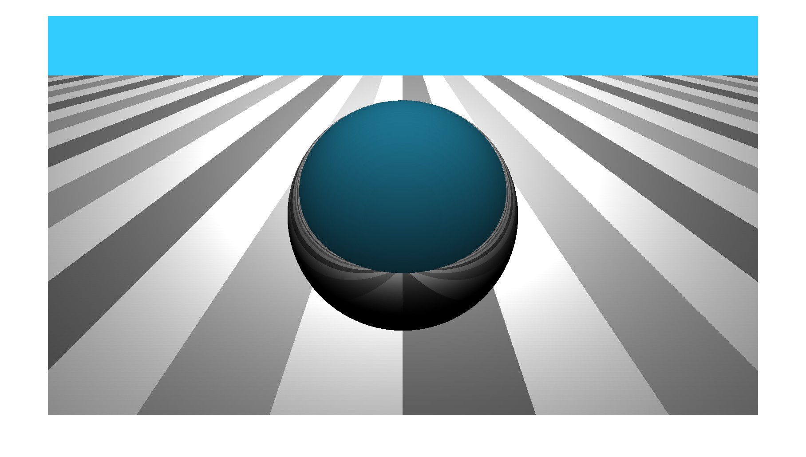

# Raytracing

**🚨 WARNING:** If you are a FRI student feel free to use this code to help yourself with your own (raytracing) project. But please do not copy the code or its segments, because plagiarism is taken very seriously at our faculty!

## Description

This is an implementation of raytracing in Matlab created during the Mathematical modeling course at Faculty of Computer and Information Science - University of Ljubljana.

## Usage

Open the file `test_raytracing.m` with Matlab or Octave and hit the Run button or type `test_raytracing` in the console. A rendered image should appear on your screen in a few seconds.

**Note:** if you are using Octave it may take a lot more time to render the image.

## Customization
### Resolution
You can change the image resolution by changing the variables `image_width` and `image_height` in `test_raytracing.m`.

### Different objects
You can use your own custom objects by changing the inline functions `f`, `f1` and `f2`. Make sure
to also correctly change the corresponding partial derivatives (eg. `dfdx`, `dfdy` and `dfdz`), otherwise
the object may not render correctly.

**Note:** the defined functions should have an equation of the form `f(x, y, z) = 0`. Your custom 
function definition in the code should then look like the following: \
`f = @(x, y, z) left_hand_side_of_the_equation`

## Example images

Here are two example renders. The first one features some generative colouring and the second one
has a reflective shader. You can find a few more examples in the `images` folder.

